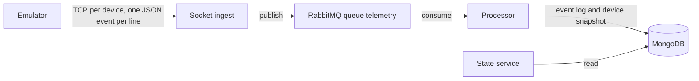

# Architecture

The emulator opens one long-lived TCP connection per device and writes device events. Ingest validates each event and publishes it to the `telemetry` queue. The processor is the only writer: it appends the event and updates that device's snapshot. The state service only reads those two MongoDB collections.

MongoDB, RabbitMQ, the state service, ingest, and the processor run in `compose.yaml`. The emulator is in that file under the `emulator` profile.
