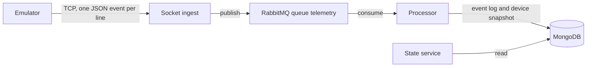

# Architecture

The emulator opens a long-lived TCP connection to ingest and writes telemetry events. Ingest validates each event and publishes it to the `telemetry` queue. The processor is the only writer: it appends the event and updates that device's snapshot. The state service only reads those two MongoDB collections.

MongoDB and RabbitMQ run beside the state service in `compose.yaml`. The processor and emulator packages are present and have no behavior yet.
