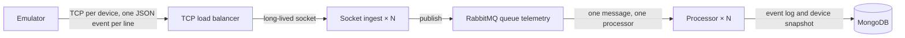

# Architecture

The emulator opens one long-lived TCP connection per device and writes device events. A TCP load balancer can spread those connections across ingest replicas. Ingest validates each event and publishes it to the `telemetry` queue. Processor replicas read that queue, and one message goes to one processor. The processor appends the event and updates that device's snapshot. It creates the indexes on startup.

MongoDB, RabbitMQ, ingest, and the processor run in `compose.yaml`. The emulator is in that file under the `emulator` profile. The load balancer is not in that file.
